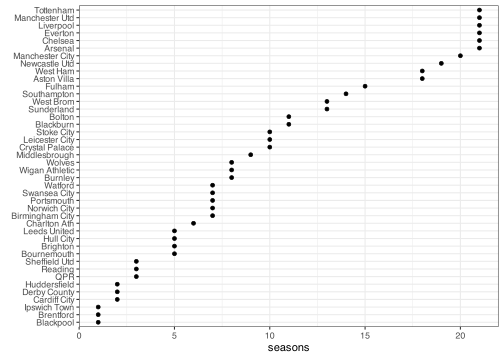

Premier League 2001/02 - 2021/22
================

``` r
library(tidyverse)
library(rvest)
```

``` r
theme_set(theme_bw())
```

``` r
URL <- "https://fbref.com/en/comps/9/history/Premier-League-Seasons"
```

``` r
seasons.scrap <- 
  read_html(URL) %>% 
  html_node(xpath = '//table[@id="seasons"]') %>% 
  html_nodes(xpath = '//th[@data-stat="season"]') %>% 
  html_nodes("a")

seasons.names <- seasons.scrap %>% html_text()
seasons.urls <- seasons.scrap %>% html_attr("href")
seasons.urls <- paste0("https://fbref.com", seasons.urls)

seasons_df <- 
  tibble(season = seasons.names,
         url = seasons.urls) %>% 
  filter(str_sub(season, 1, 4) %>%
           as.integer() %>%
           between(2001, 2021))
```

``` r
seasons_df
```

    ## # A tibble: 21 × 2
    ##    season    url                                                              
    ##    <chr>     <chr>                                                            
    ##  1 2021-2022 https://fbref.com/en/comps/9/11160/2021-2022-Premier-League-Stats
    ##  2 2020-2021 https://fbref.com/en/comps/9/10728/2020-2021-Premier-League-Stats
    ##  3 2019-2020 https://fbref.com/en/comps/9/3232/2019-2020-Premier-League-Stats 
    ##  4 2018-2019 https://fbref.com/en/comps/9/1889/2018-2019-Premier-League-Stats 
    ##  5 2017-2018 https://fbref.com/en/comps/9/1631/2017-2018-Premier-League-Stats 
    ##  6 2016-2017 https://fbref.com/en/comps/9/1526/2016-2017-Premier-League-Stats 
    ##  7 2015-2016 https://fbref.com/en/comps/9/1467/2015-2016-Premier-League-Stats 
    ##  8 2014-2015 https://fbref.com/en/comps/9/733/2014-2015-Premier-League-Stats  
    ##  9 2013-2014 https://fbref.com/en/comps/9/669/2013-2014-Premier-League-Stats  
    ## 10 2012-2013 https://fbref.com/en/comps/9/602/2012-2013-Premier-League-Stats  
    ## # … with 11 more rows

``` r
scrap_season_table <- function(url) {
  Sys.sleep(5) # to avoid HTTP error 429
  
  read_html(url) %>% 
    html_node("table") %>% 
    html_table() %>% 
    as.data.frame() %>% 
    mutate(Attendance = 
             Attendance %>% 
             str_replace(",", "") %>% 
             as.integer())
}

seasons_df <- 
  seasons_df %>% 
  mutate(data = map(url, scrap_season_table))
```

``` r
seasons_df %>% 
  select(season, data)
```

    ## # A tibble: 21 × 2
    ##    season    data          
    ##    <chr>     <list>        
    ##  1 2021-2022 <df [20 × 19]>
    ##  2 2020-2021 <df [20 × 19]>
    ##  3 2019-2020 <df [20 × 19]>
    ##  4 2018-2019 <df [20 × 19]>
    ##  5 2017-2018 <df [20 × 19]>
    ##  6 2016-2017 <df [20 × 15]>
    ##  7 2015-2016 <df [20 × 15]>
    ##  8 2014-2015 <df [20 × 15]>
    ##  9 2013-2014 <df [20 × 15]>
    ## 10 2012-2013 <df [20 × 15]>
    ## # … with 11 more rows

``` r
unnest_df <-
  seasons_df %>% 
  select(season, data) %>% 
  unnest(data)
```

``` r
unnest_df %>% 
  filter(Rk == 1) %>% 
  count(Squad,
        sort = TRUE,
        name = "titles")
```

    ## # A tibble: 6 × 2
    ##   Squad           titles
    ##   <chr>            <int>
    ## 1 Manchester City      6
    ## 2 Manchester Utd       6
    ## 3 Chelsea              5
    ## 4 Arsenal              2
    ## 5 Leicester City       1
    ## 6 Liverpool            1

``` r
unnest_df %>% 
  group_by(Squad) %>% 
  summarise(titles = sum(Rk == 1),
            top4 = sum(Rk <= 4),
            relegations = sum(Rk >= 18),
            seasons = n(),
            points = sum(Pts)) %>% 
  arrange(-points)
```

    ## # A tibble: 42 × 6
    ##    Squad           titles  top4 relegations seasons points
    ##    <chr>            <int> <int>       <int>   <int>  <int>
    ##  1 Manchester Utd       6    16           0      21   1618
    ##  2 Chelsea              5    17           0      21   1604
    ##  3 Arsenal              2    15           0      21   1533
    ##  4 Liverpool            1    13           0      21   1522
    ##  5 Manchester City      6    12           0      20   1406
    ##  6 Tottenham            0     7           0      21   1321
    ##  7 Everton              0     1           0      21   1149
    ##  8 Newcastle Utd        0     2           2      19    922
    ##  9 West Ham             0     0           2      18    853
    ## 10 Aston Villa          0     0           1      18    831
    ## # … with 32 more rows

``` r
unnest_df %>% 
  count(Squad, name = "seasons") %>% 
  ggplot(aes(fct_reorder(Squad, seasons), seasons)) +
  geom_point(stat = "identity") +
  coord_flip() +
  labs(x = element_blank())
```


